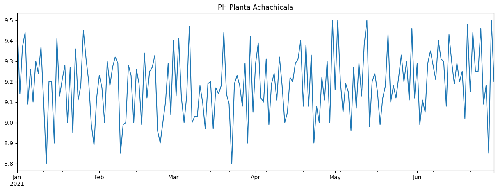
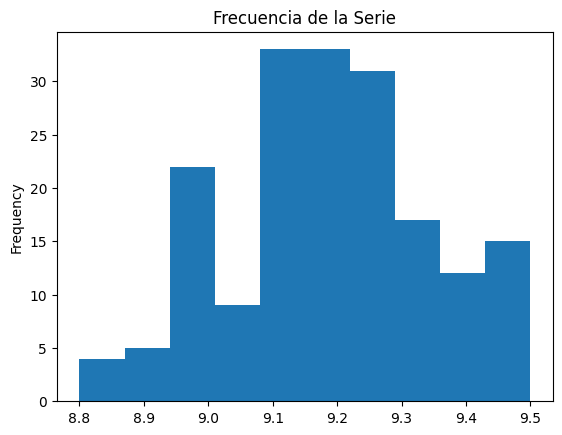
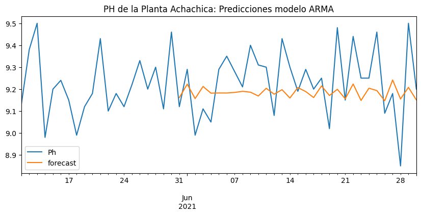
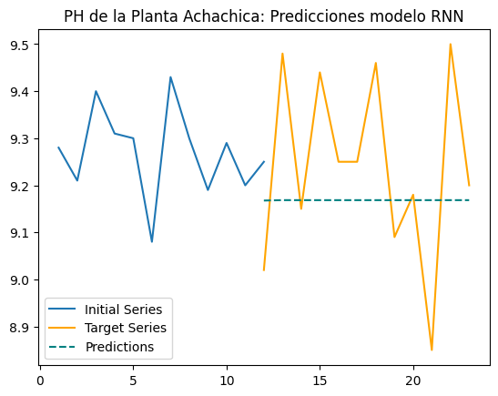
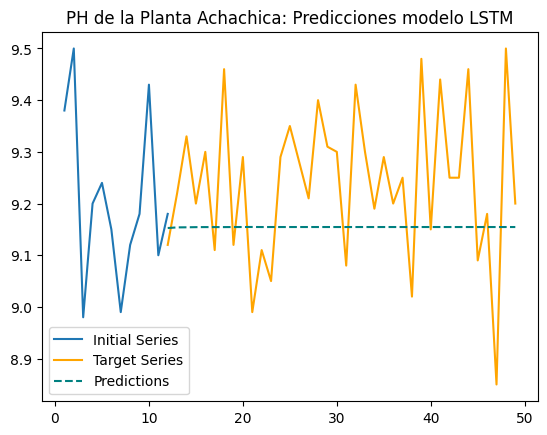

## Predicción del PH de Planta de Tratameinto de Agua Potable Achachicala

### Objetivo

El objetivo del presente trabajo es desarrollar un modelo que permita predecir la nivel de PH de la planta de tratamiento de agua Achichicala. Esto a partir de los datos tomados diariamente en un lapso de 6 meses.

### Prerequisitos

Las librerias necesarias están listadas en requirements.txt. También se incluye environment.yml para los usuarios de Anaconda.

### Datos

Los datos provienenen de las mediciones del nivel de PH de tomados de la planta Achachicala, ubicada en la ciudad de La Paz en Bolivia, como parte del control normado por Ley. El rango de tiempo es de 6 meses, con una frecuencia de una muestra por día. La muestra se tomó entre el primero de enero y el 30 de junio del 2021.

### Exploración Inicial de Datos

Se grafica la serie de tiempo junto con un gráfico de violín por semana.

 

Visualmente, no hay tendencia ni variaciones estacionarias. Adicionalmente se muestra un gráfico de frecuencias para visualizar la ausencia de tendencia y la distribción normal de los datos respecto al promedio. 

Finalmente, se ejecuta un test de Dickey-Fuller y con un *p-value* de 3.908e-12 se tdescarta la hipóteis *Null* y se acepta que nuestros datos son estacionarios.

### Construcción del modelo
Se probaron tres modelos diferentes. El primero fue un modelo ARMA, el segundo un modelo RNN (*Recurrent Neural Network*) y el tercero fue un LSTM (*Long-Short Term Memory). los resultados se muestran a continuación.
 
   

### Selección del modelo

A continuación se ilustra los resultados de cada uno de los modelos.

Se observa que el modelo con una capa oculta es el que mejor se desempeña en el test set bajo la métrica "Accuracy". Este modelo tiene la función tanh como función de activación en la capa oculta y consta de 30 neuronas en la misma. 

### Explicabilidad del Modelo

Se desea conocer la importancia de cada una de las variables en el momento de hacer la predicción por parte del modelo. Para ello se usa la técnica de permutación. Esta consiste en permutar los valores de las filas de cada columna, una columna a la vez, y calcular como el desempeño es afectado por esta permutación. Aquellas columnas (esto es, las variables) cuya permutación cause la mayor caída en el desepeño serán las mas importantes para el modelo.

A continuación se detallan los resultados de permutación para el trainin-set y test-set.

 

Se observa que thall_3 (talasemia, defecto reversible) es una varible muy importante cuando se usa el test set, pero qno así en el training set. Esto sugiere que el modelo puede no estar capturando parte de la complejidad en los datos. También se puede ver que caa (número de vasos principales) es una variable muy importante cuando se usa el training set, pero no con el test set. Esto puede ser una señal de que esta varible esta causando overfitting.

### Conclusiones

El modelo que mejor se desempeña con la métrica escogida es el de arquitectura más simple. Sin embargo, todavía es posible mejorar este modelo buscando hiperparámetros más óptimos realizando una busqueda exaustiva con "Grid Search".

### Contacto

jimenezc.bo@gmail.com  

antonio.jimzC@gmail.com 
